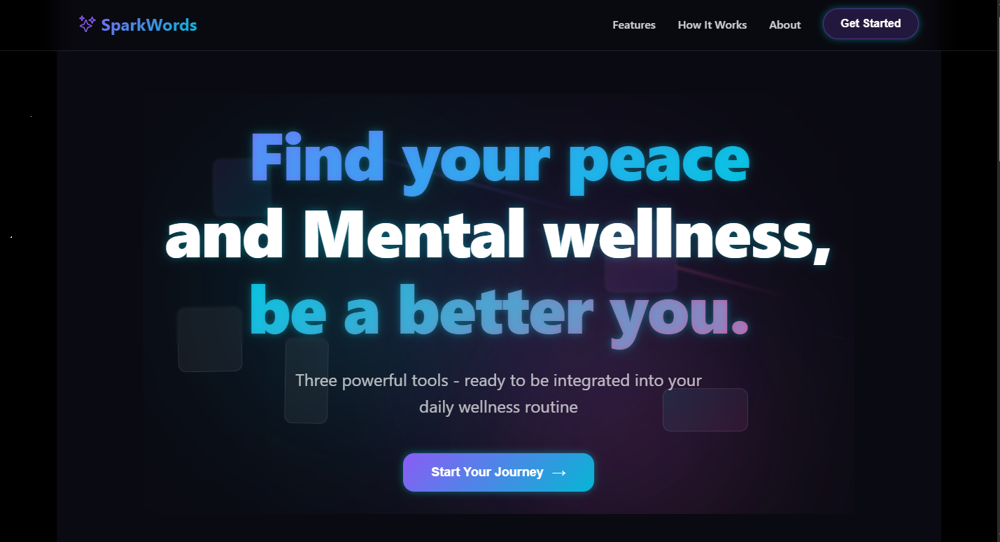
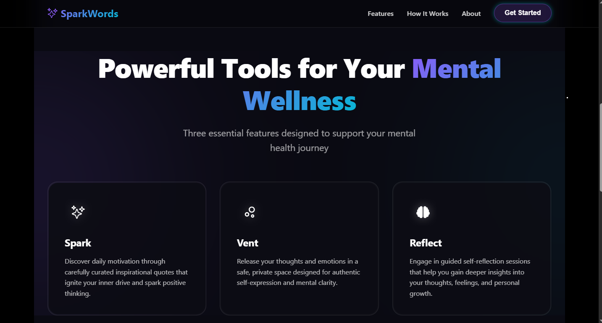

# ✨ SparkWords

**Your personal space for mental clarity and emotional wellness**

SparkWords is a beautifully designed mental wellness web application that provides users with a private, glassmorphic interface to improve their mental clarity.

## 🌟 Features

### 🔥 **Spark** - Daily Inspiration
- Curated motivational quotes and affirmations
- Mood-based quote recommendations

### 💭 **Vent** - Emotional Release  
- Private journaling space with mood selection
- Personalized writing prompts

### 🔍 **Reflect** - Guided Self-Discovery
- Structured reflection sessions
- Personal growth insights

## 🎨 Design
- Modern glassmorphic design
- Smooth animations and effects
- Fully responsive for all devices

## 🛠️ Built With
- React 18 with Vite
- Modern CSS with Glassmorphism
- React Icons
- Deployed on Vercel

## 📞 Connect
- **GitHub**: [Rioposts](https://github.com/Rioposts)
- **Email**: mullafawaz@gmail.com

---
**"Clarity begins with a single spark."** ✨
